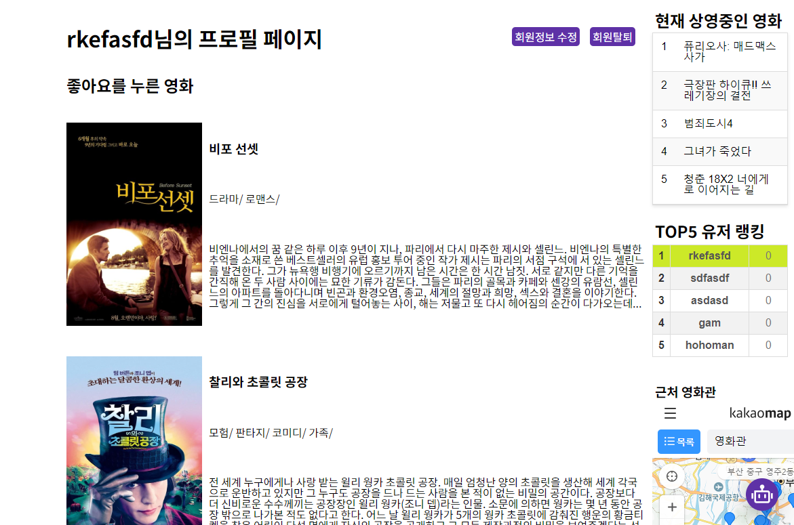

# 이동진과 두근두근 영화데이트
프로젝트 기간 : 24.05.16 - 24.05.24
---
## 소개
Python 기반의 연애 시뮬레이션 게임 프로그램인 ren py와 영화 월드컵을 통해 유저들의 선호 영화와 영화 장르들을 수집하고, 그를 기반으로 영화 추천해주는 프로젝트입니다.<br>
Sendbird의 Chatbot Ai에게 kobis 사이트의 영화 정보 데이터를 학습시켜 Ai와 대화를 통한 영화추천 및 현재 상영 영화들을 소개 받을 수 있습니다. <br>
그 외에 영화별 댓글, 좋아요, 점수기능, 유저팔로우, 회원가입, 로그인, 회원탈퇴 등의 기능이 있습니다.
### 로그인 페이지


### 회원가입 페이지


### 맞춤별 영화추천 페이지


### 영화 정보 페이지


### 회원 정보 페이지


### 영화 월드컵 페이지


### Renpy를 이용한 게임페이지


### ERD


### chat gpt를 이용한 코드 오류 해결


### chat gpt를 이용한 sendbird chat AI (knowledge base : KOBIS site)


```vue
<!-- LoginView.vue -->
<script>
import $ from 'jquery'
import 'jquery.easing'
onMounted(() => {
  var current_fs, next_fs, previous_fs
  var left, opacity, scale
  var animating

  $(".next").click(function () {
    if (animating) return false;
    animating = true;

    current_fs = $(this).parent();
    next_fs = $(this).parent().next();

    $("#progressbar li").eq($("fieldset").index(next_fs)).addClass("active");

    next_fs.show();
    current_fs.animate({ opacity: 0 }, {
      step: function (now, mx) {
        scale = 1 - (1 - now) * 0.2;
        left = (now * 50) + "%";
        opacity = 1 - now;
        current_fs.css({
          'transform': 'scale(' + scale + ')',
          'position': 'absolute'
        });
        next_fs.css({ 'left': left, 'opacity': opacity });
      },
      duration: 800,
      complete: function () {
        current_fs.hide();
        animating = false;
      },
      easing: 'easeInOutBack'
    });
  });

  $(".previous").click(function () {
    if (animating) return false;
    animating = true;

    current_fs = $(this).parent();
    previous_fs = $(this).parent().prev();

    $("#progressbar li").eq($("fieldset").index(current_fs)).removeClass("active");

    previous_fs.show();
    current_fs.animate({ opacity: 0 }, {
      step: function (now, mx) {
        scale = 0.8 + (1 - now) * 0.2;
        left = ((1 - now) * 50) + "%";
        opacity = 1 - now;
        current_fs.css({ 'left': left });
        previous_fs.css({ 'transform': 'scale(' + scale + ')', 'opacity': opacity });
      },
      duration: 800,
      complete: function () {
        current_fs.hide();
        animating = false;
      },
      easing: 'easeInOutBack'
    });
  });
});
</script>
```

## 팀원
- 이승민 : [승민 개인 github](https://github.com/Nooby213)
- 이권민 : [권민 개인 github](https://github.com/Gongman41)
- 프로젝트 : [pjt github](https://github.com/Gongman41/dongjin_love)
  
## tools
- JS:
Vue와 함께 사용하여 프론트엔드에서 동기 및 비동기 동작을 조정합니다. 또한 axios를 활용하여 Django 서버로 데이터를 요청하고 응답을 처리합니다.
- Github:
프로젝트의 협업과 소스 코드의 버전 관리를 위해 사용됩니다. Git 브랜치를 통해 각자의 작업을 분리하고 병합하여 효율적으로 협업할 수 있습니다.
- Vue 3:
Vue.js 프레임워크를 사용하여 사용자 인터페이스를 구축합니다. Vue의 Single File Components (SFC)를 활용하여 각 컴포넌트를 구조화하고 관리합니다.
- Django:
Python 기반의 웹 프레임워크로, 데이터 요청 및 관리를 위해 사용됩니다. Django ORM을 사용하여 데이터베이스와의 상호 작용을 처리하고, RESTful API를 구축하여 클라이언트와 통신합니다.
- SendBird:
영화 추천을 위해 SendBird의 Chat AI를 활용합니다. 사용자와의 대화를 통해 사용자의 취향을 파악하고, 관련된 영화를 추천합니다.
- Ren'Py:
Python 기반의 시각 소설 및 시뮬레이션 게임 엔진으로, 연애 시뮬레이션 게임 프로그램을 통해 사용자의 영화 취향 데이터를 수집합니다.

### 느낀점
- 이승민 : 배우지 않았던 여러 툴과 라이브러리를 써보며, 낯선 환경 속에서도 개발을 해가는 방법을 터득했습니다. 프로젝트를 진행해보며 그동안 애매하게 알았던 내용을 복습하고 실제로 써보며 활용성을 깨닫느 시간이었습니다. 다음 프로덱트 때는 계획을 잘 세워 시간 배분과 역할을 잘 놔눠 수행해야 될 것 같습니다. 프로젝트를 처음 도전해봐서 계획과 목표가 계속 바껴서 힘들었지만 파트너가 같이 지치지 않고 같이 해주어서 할 수 있었습니다. shout out to gm
- 이권민 : 힘들었지만 많이 성장한 시간이었습니다. 저희 조의 경우 명세서만 따라가기보다 새로운 툴이나 기능에 대한 도전이 많았습니다. 렌파이라는 아예 처음 보는 툴도 써보고, 처음으로 배포도 진행했습니다. 그 과정에서 단순한 문제에 막히기도 하고 점점 줄어드는 시간에 조바심이 나기도 했지만 그만큼 얻어가는 게 많았던 것 같습니다. 더 배우고 더 성장해서 다음 프로젝트는 더 재밌게 하고 싶다는 생각이 들었습니다. shout out to sm